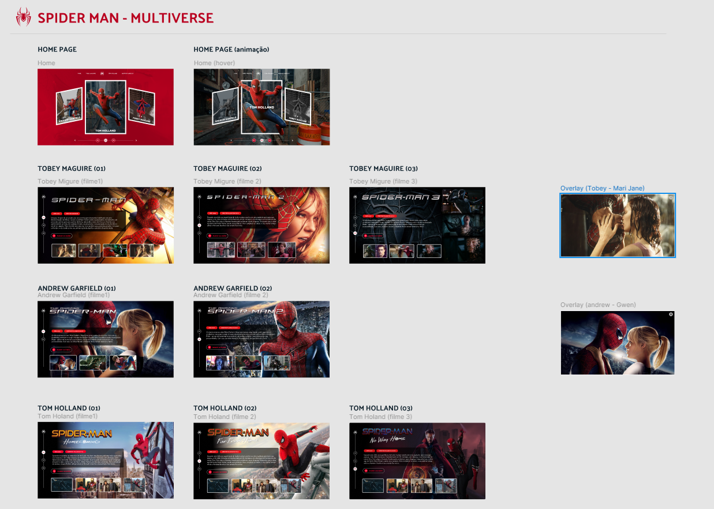

# Projeto Angular - Spider-Man Multiverse

Este projeto utiliza o framework Angular para criar uma aplicação interativa que apresenta um carrossel de filmes baseados no personagem Spider-Man, explorando diferentes versões do herói interpretadas por Tobey Maguire, Tom Holland e Andrew Garfield. A aplicação permite ao usuário interagir com uma galeria de filmes e acessar detalhes como sinopse, ano, diretor, além de assistir aos trailers dos filmes.

## Funcionalidades

- **Página Inicial (Home)**: Exibe um carrossel de cartões com diferentes versões do Spider-Man, permitindo ao usuário escolher entre Tobey Maguire, Tom Holland e Andrew Garfield.
  - **Efeito 3D no Carrossel**: Ao passar o mouse sobre um cartão, ele aumenta e destaca a versão do herói, enquanto o fundo muda conforme o cartão selecionado.
  - **Controle de Navegação**: Botões permitem ao usuário navegar entre as versões do Spider-Man, alterando a visualização do carrossel.
  
- **Página de Detalhes do Filme (Content)**: Ao selecionar um personagem, o usuário é redirecionado para uma página com detalhes específicos do filme:
  - **Logo e Imagem de Fundo**: Exibe o logo do filme e uma imagem de fundo ou vídeo.
  - **Sinopse e Informações do Filme**: Exibe detalhes como o ano de lançamento, diretor e uma sinopse do filme.
  - **Galeria de Imagens**: Uma galeria de imagens relacionadas ao filme.
  - **Trailer**: Link para assistir ao trailer do filme.

## Tecnologias Utilizadas

- **Angular**: Framework JavaScript para desenvolvimento de Single Page Application (SPA).
- **TypeScript**: Linguagem de programação que adiciona tipagem estática ao JavaScript.
- **CSS Flexbox & 3D Transforms**: Layouts responsivos e animações para a interface de usuário, incluindo efeitos 3D no carrossel.
- **Fancybox**: Biblioteca para visualizar as imagens da galeria em um modal.

## Estrutura do Projeto

- **Componentes**:
  - `HomeComponent`: Exibe a página inicial com o carrossel de filmes.
  - `ContentComponent`: Exibe os detalhes de um filme quando o usuário seleciona uma versão do Spider-Man.
  
- **Roteamento**: O projeto usa roteamento dinâmico para carregar as páginas de conteúdo com base nos parâmetros da URL (ID do personagem e ID do filme).

- #Projeto feito na Dio em html/css/javascript -> eu fiz a refatoração para angular e toda parte dinâmica de criação de páginas.
